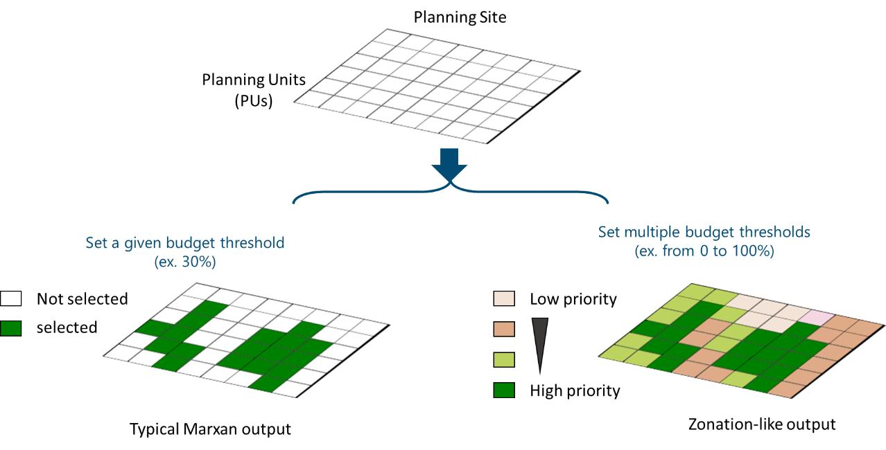
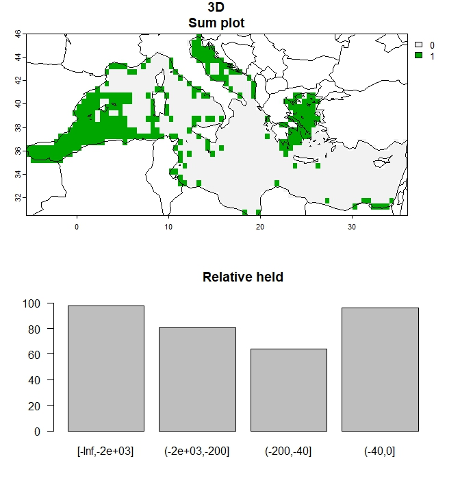

<!-- badges: start -->
  [](https://CRAN.R-project.org/package=prior3D)
  [](https://github.com/cadam00/prior3D/actions/workflows/R-CMD-check.yaml)
  <!-- badges: end -->

**This work was supported by the European Union’s Horizon 2020 research and innovation programme HORIZON-CL6–2021-BIODIV-01–12 under grant agreement No 101059407 “MarinePlan – Improved transdisciplinary science for effective ecosystem-based maritime spatial planning and conservation in European Seas”.**

## 1 **Introduction to the prior3D Package (tutorial)**

The **prior3D** package offers a comprehensive toolset for 3D systematic
conservation planning, conducting nested prioritization analyses across
multiple depth levels and ensuring efficient resource allocation
throughout the water column ([Doxa et al. 2022](#ref-doxa20224d)). It
provides a structured workflow designed to address biodiversity
conservation and management challenges in the 3 dimensions, such as the
incorporation of multiple costs at different depth levels, while
facilitating users’ choices and parameterization. The process initiates
from the deepest level and progressively moves toward the surface, by
conducting a step-by-step prioritization analysis at each depth Figure
[1](#fig-Figure1). The optimization result at each depth level is considered as
a cost layer for the layer above. This approach gives priority to areas chosen
in deeper waters when selecting areas at the subsequent upper level, thus
creating a cascading prioritization structure. The **prior3D** package is built
upon the **prioritizr** package ([Hanson et al. 2024](#ref-prioritizr)), using
commercial and open-source exact algorithm solvers that ensure optimal solutions
to prioritization problems.

<p align="center">
  
</p>
<p class="caption" align="center">
<span id="fig-Figure1"></span>Figure 1: Flow chart of the 3D
prioritization analysis for the four depth zones considered in the Doxa
et al. (<a href="#ref-doxa20224d">2022</a>) analysis
</p>

This tutorial will guide you through the key functions of the package,
from data preparation to generating informative outputs to address
conservation challenges in diverse marine (and terrestrial) ecosystems
and enable informed decision-making in biodiversity conservation,
restoration and management.

## 2 **Workflow: Running the analysis**

The package provides two options for conducting analyses:

1.  Running a Step-by-Step 3D SCP analysis

2.  Running a Comparative Analysis of a 2D and a 3D SCP approach

When opting for the step-by-step analysis (first option), the workflow
proceeds as follows:

1.  Use the `split_rast()` function to convert 2D distribution rasters
    of biodiversity features into a 3D format.

2.  Use the `prioritize_3D()` function to set the optimization problem
    and define its parameters. This function also solves the problem and
    provides the solution in the form of a map.

3.  Use the `evaluate_3D()` function to obtain detailed results in a
    tabular format.

4.  Use the `plot_3D()` function to generate graphs based on the
    solution results.

When opting for a comparative analysis of a 2D and a 3D SCP approach
(second option), users can use the `Compare_2D_3D()` function. This
function incorporates the aforementioned detailed workflow and applies
it to both 2D and 3D approaches, streamlining and simplifying the
analysis process for users. By using this function, users provide the
input data, define the optimization problem and its parameterization,
run the analysis and finally obtain the results in the form of maps,
graphs and tables.

The **spatial coherence** of the solution maps can be evaluated through
a post-processing analysis, which can be conducted after either the
step-by-step or the comparative analysis. The necessary functions for
this assessment are also provided within the package.

## 3 Installation

All the functions of the package prior3D can be installed in R via:

``` r
if (!require(remotes)) install.packages("remotes")
remotes::install_github("cadam00/prior3D")
```

## 4 **Illustration example**

Let us consider the following dataset as an illustrative example. It
represents a subset of the species analyzed in Doxa et al.
([2022](#ref-doxa20224d)). For simplicity reasons, we have included only
20 species for demonstration purposes.

**Biodiversity features**

Two types of input data are needed for the biodiversity features.

1.  Species information tables in tabular form (`data.frame`). The first
    `data.frame` contains information about the features. If the
    biodiversity features concern species then this data.frame must
    indicate at least the species name and species classification as
    pelagic or benthic (mandatory). Additional optional data may include
    species assignment to prioritization groups and, if available, the
    species’ bathymetric range (min and max depth at which the species
    occurs). The second `data.frame` is a prioritization weights table,
    where users can assign specific weights to different prioritization
    groups. These groups can represent any meaningful categorization for
    the prioritization process, like taxonomical, functional, or
    conservation status categories, such as those defined by the IUCN.

2.  Biodiversity distribution data in 2D raster form. These rasters
    contain the information on the spatial distribution of the features
    across the study area. Biodiversity distribution information can
    represent either presence-absence data (binary) or any continuous
    information, such as biomass/abundance, probability of occurrences.

``` r
# Import prior3D R package
library(prior3D)

# Species information table
data(biodiv_df)
head(biodiv_df)
```

``` r
##               species_name pelagic min_z max_z
## 1   acanthocybium_solandri       1   -20     0
## 2    acantholabrus_palloni       0  -500   -30
## 3 acanthomysis_longicornis       0  -100    -2
## 4      abraliopsis_morisii       0 -3660     0
## 5          abralia_veranyi       0  -900    -1
## 6     abraliopsis_pfefferi       0  -750    -1
```

``` r
# Biodiversity distribution data in 2D raster form
biodiv_raster <- get_biodiv_raster()
biodiv_raster
```

``` r
## class       : SpatRaster 
## dimensions  : 31, 83, 20  (nrow, ncol, nlyr)
## resolution  : 0.5, 0.5  (x, y)
## extent      : -5.5, 36, 30.5, 46  (xmin, xmax, ymin, ymax)
## coord. ref. : lon/lat WGS 84 (EPSG:4326) 
## source      : biodiv_raster.tif 
## names       : aapto~aptos, abiet~etina, abra_alba, abral~ranyi, abral~risii, abral~fferi, ... 
## min values  :        0.01,        0.01,      0.01,        0.01,        0.01,        0.01, ... 
## max values  :        1.00,        0.63,      1.00,        1.00,        1.00,        1.00, ... 
```

**Planning site, planning units and depth levels**

In the illustration example, we consider as our planning site the
Mediterranean Sea, with 0.5&deg;x0.5&deg; cells as our planning unites (PUs).
We consider four depth levels: (i) 0 to 40 m (infralittoral zone, extending to
the lower limit of photophilic algae and seagrasses), (ii) 40 to 200 m
(circalittoral zone, continental shelf, animal-dominated), (iii) 200 to 2000 m
(~continental slope), and (iv) exceeding 2000 m in depth (lower bathyal plains
and abyssal zone) (Figure [2](#fig-Figure2)).

<p align="center">
  
</p>
<p class="caption" align="center">
<span id="fig-Figure2"></span>Figure 2: The study area and the
considered depth zones
</p>

To conduct the analysis, a SpatRaster object containing bathymetric data
for the planning site is needed. This raster should represent depths
with negative values and match the extent and resolution of the
biodiversity rasters. Alternatively, if bathymetry maps of greater
resolution and broader extent are available, they can also be used, as
the prior3D functions internally conduct cropping and resampling to
match the biodiversity data. Producing the final depth raster that
delineates the desired depth zones is also produced by the prior3D
functions.

``` r
# Biodiversity distribution data in 2D raster form
depth_raster <- get_depth_raster()
depth_raster
```

``` r
## class       : SpatRaster 
## dimensions  : 31, 83, 1  (nrow, ncol, nlyr)
## resolution  : 0.5, 0.5  (x, y)
## extent      : -5.5, 36, 30.5, 46  (xmin, xmax, ymin, ymax)
## coord. ref. : lon/lat WGS 84 (EPSG:4326) 
## source      : depth_raster.tif 
## name        : depth_raster 
## min value   :  -4082.70312 
## max value   :     -6.60191
```

## 5 **Step-by-Step 3D SCP analysis**

### 5.1 **Step 1: Data Preparation**

**Transforming Biodiversity Distributions into Multilevel (3D) Data**

The `split_rast()` function is used to convert 2D distributions of
biodiversity features (rasters) into a 3D format.

``` r
# Splitting features' 2D distributions into 3D ones
split_features <- split_rast(biodiv_raster,
                             depth_raster,
                             breaks = c(0, -40, -200, -2000, -Inf),
                             biodiv_df,
                             val_depth_range=TRUE)
```

The output is a list containing species distributions for each
bathymetric layer, necessary for the analysis next steps.

### 5.2 **Step 2: 3D Prioritization Algorithm**

The 3D prioritization algorithm is implemented using the
`prioritize_3D()` function, the core function of the **prior3D**
package. This function uses the list generated from the `split_rast()`
function and other necessary inputs.

``` r
single_3D <- prioritize_3D(split_features  = split_features,
                           depth_raster    = depth_raster,
                           breaks          = c(0, -40, -200, -2000, -Inf),
                           biodiv_df       = biodiv_df,
                           budget_percents = 0.3,
                           budget_weights  = "richness",
                           threads         = parallel::detectCores(),
                           portfolio       = "gap", #"shuffle"
                           portfolio_opts  = list(number_solutions = 10))
```

``` r
## [1] "Budget: 0.3"
```

<u>Notes:</u>

`budget_percent`: Contrarily to its strict economic definition, budget
reflects the desired level of protection to be modeled. It ranges from 0
to 1, with 0 indicating no resources available for protection, while 1
signifies resources sufficient to protect the entire study area.
Typically, setting a budget of 0.3 corresponds to the 30% conservation
target (i.e. 30% of the total area set aside for conservation). Users
also have the flexibility to define multiple budget levels using a
vector, allowing for the exploration of various protection scenarios.
For instance, a vector like `c(0.1, 0.3, 0.5)` represents three
scenarios where 10%, 30%, and 50% of the study area are designated for
protection.

`budget_weights`: The `prioritize_3D()` function allows users to specify
how the budget is distributed among depth levels. Three allocation
methods are available:

1.  Equal Distribution: Allocates an equal share of the budget to each
    depth level (`budget_weights ="equal"`).

2.  Proportional to Area: Allocates budget based on the spatial extent
    of each depth level (`budget_weights ="area"`).

3.  Proportional to Species Richness: Prioritizes budget allocation to
    depth levels with higher species diversity (number of species).
    (`budget_weights = "richness"`)

### 5.3 **Step 3: Generating Outputs**

**Prioritization Maps**

The `prioritize_3D()` function is used to generate prioritization maps.
Single budget settings (ex. `total_budget=0.3`) produce standard maps,
as typical Marxan outputs. Multiple budgets, by using a vector (ex.
`c(0.1,0.3,0.5)`, indicating available resources sufficient to protect
10%, 30% and 50% of the area) result in cumulative maps, illustrating
areas selected by various budget levels. Although this output follows a
different approach, it resembles to typical Zonation output maps.


<p align="center">
  
</p>
<p class="caption" align="center">
<span id="fig-Figure3"></span>Figure 3: Prioritization maps for single and
multiple budget percentages
</p>

``` r
# Create plot of outputs for a single budget percentage
plot_3D(single_3D, to_plot="all", add_lines=FALSE)
```

<p align="center">
  
</p>
<p class="caption" align="center">
<span id="fig-Figure4"></span>Figure 4: Output for 30% budget percentage
</p>

And for multiple budgets

``` r
# Create plot of outputs for multiple budget percentages
multuple_3D <- prioritize_3D(split_features  = split_features,
                             depth_raster    = depth_raster,
                             breaks          = c(0, -40, -200, -2000, -Inf),
                             biodiv_df       = biodiv_df,
                             budget_percents = seq(0,1,0.1),
                             budget_weights  = "richness",
                             threads         = parallel::detectCores(),
                             portfolio       = "gap",
                             portfolio_opts  = list(number_solutions = 10))
```

``` r
## [1] "Budget: 0"
## Warning: Portfolio could only find 1 out of 10 solutions.
## Warning: Portfolio could only find 1 out of 10 solutions.
## Warning: Portfolio could only find 1 out of 10 solutions.
## Warning: Portfolio could only find 1 out of 10 solutions.
## [1] "Budget: 0.1"
## [1] "Budget: 0.2"
## [1] "Budget: 0.3"
## [1] "Budget: 0.4"
## [1] "Budget: 0.5"
## [1] "Budget: 0.6"
## [1] "Budget: 0.7"
## [1] "Budget: 0.8"
## [1] "Budget: 0.9"
## [1] "Budget: 1"
## Warning: Problem failed presolve checks.
## 
## These checks indicate that solutions might not identify meaningful priority
## areas:
## 
## ✖ Budget is greater than the total cost of selecting all planning units.
## → Maybe you made a mistake when setting the `budget` in the objective function?
## 
## ℹ For more information, see `presolve_check()`.
```

``` r
plot_3D(multuple_3D)
```

<p align="center">
  
</p>
<p class="caption" align="center">
<span id="fig-Figure5"></span>Figure 5: Output for multiple budget
percentages
</p>

## 6 **Comparative Analysis of a 2D and a 3D SCP approach**

To facilitate comparisons between 3D and 2D approaches, the
`compare_2D_3D()` function is provided in the package. This function
enables users to conduct all the above mentioned steps of analysis (data
generation, setting and solving the optimization problem and producing
outputs), by executing both 2D and 3D approaches, with similar settings,
that facilitate comparisons. The function `plot_Compare_2D_3D()`
generates corresponding maps and graphs for both approaches.

``` r
out_2D_3D <- Compare_2D_3D(biodiv_raster = biodiv_raster,
                           depth_raster = depth_raster,
                           breaks = c(0, -40, -200, -2000, -Inf),
                           biodiv_df = biodiv_df,
                           budget_percents = seq(0, 1, 0.1),
                           budget_weights = "richness",
                           threads = parallel::detectCores(),
                           portfolio = "gap", #"shuffle"
                           portfolio_opts = list(number_solutions = 10))

plot_Compare_2D_3D(out_2D_3D, to_plot="all", add_lines=FALSE)
```

<p align="center">
  
</p>
<p class="caption" align="center">
<span id="fig-Figure6"></span>Figure 6: Comparison of 2D vs 3D approach
for multiple budget percentages
</p>

## 7 **Spatial Coherence Metrics**

The spatial coherence of the prioritization output (optimization
solution) maps is assessed using three metrics: average surface
roughness (SA), surface kurtosis (SKU), and the RAO index. These can be
used for comparison among solution 2D and 3D solutions.

High SA values signify that there is a high spatial heterogeneity,
indicating lower spatial coherence. High SKU indicate high spatial
coherence. Both SA and SKU are calculated using R package **geodiv**
([Smith et al. 2023](#ref-geodiv)), applying `geodiv::focal_metrics`
functions “sa” and “sku” to optimization solution rasters.

High RAO values suggest increased spatial heterogeneity, thus low
spatial coherence. To compute the RAO metric, a moving window approach
is employed on optimization solution maps, using function
`rasterdiv::paRao` from R package **rasterdiv** ([Rocchini, Thouverai,
et al. 2021](#ref-rasterdiv); [Rocchini, Marcantonio, et al.
2021](#ref-rasterdivpaper)). The dimensions of the window chosen is 3×3.
The new raster, which is a result of the application of the algorithm,
is used to get an average RAO value for the whole raster.

``` r
coherence(out_2D_3D, w=3)
```

``` r
## Progress metrics:  1 / 1
## Progress metrics:  1 / 1
##  sa2D  sa3D sa2Dw sa3Dw 
## 3.806 3.503 2.413 2.118 
```

<p align="center">
  
</p>
<p class="caption" align="center">
<span id="fig-Figure7"></span>Figure 7: SA
</p>

``` r
coherence(out_2D_3D, w=3, metric="sku")
```

``` r
## Progress metrics:  1 / 1
## Progress metrics:  1 / 1
## sku2D  sku3D sku2Dw sku3Dw 
## 0.347  1.138 -0.536 -0.374 
```

<p align="center">
  
</p>
<p class="caption" align="center">
<span id="fig-Figure8"></span>Figure 8: SKU
</p>

``` r
coherence(out_2D_3D, w=3, metric="rao")
```

``` r
## [1] "2D RAO"
## 
## 
## Processing alpha: 1 Moving Window: 3
## 
## 
## Processing alpha: 1 Moving Window: 3
## 
## [============================>----------------]  64% in  0s
## [============================>----------------]  65% in  0s
## [=============================>---------------]  66% in  0s
## [=============================>---------------]  67% in  0s
## [==============================>--------------]  69% in  0s
## [==============================>--------------]  70% in  0s
## [===============================>-------------]  71% in  0s
## [================================>------------]  72% in  0s
## [================================>------------]  73% in  0s
## [=================================>-----------]  75% in  0s
## [=================================>-----------]  76% in  0s
## [==================================>----------]  77% in  0s
## [==================================>----------]  78% in  0s
## [===================================>---------]  80% in  0s
## [===================================>---------]  81% in  0s
## [====================================>--------]  82% in  0s
## [====================================>--------]  83% in  0s
## [=====================================>-------]  84% in  0s
## [=====================================>-------]  86% in  0s
## [======================================>------]  87% in  0s
## [=======================================>-----]  88% in  0s
## [=======================================>-----]  89% in  0s
## [========================================>----]  90% in  0s
## [========================================>----]  92% in  0s
## [=========================================>---]  93% in  0s
## [=========================================>---]  94% in  0s
## [==========================================>--]  95% in  0s
## [==========================================>--]  96% in  0s
## [===========================================>-]  98% in  0s
## [===========================================>-]  99% in  0s
## [=============================================] 100% in  0s
## 
## [1] "3D RAO"
## 
## 
## Processing alpha: 1 Moving Window: 3
## 
## 
## Processing alpha: 1 Moving Window: 3
## 
## [=============================>---------------]  67% in  0s
## [==============================>--------------]  69% in  0s
## [==============================>--------------]  70% in  0s
## [===============================>-------------]  71% in  0s
## [================================>------------]  72% in  0s
## [================================>------------]  73% in  0s
## [=================================>-----------]  75% in  0s
## [=================================>-----------]  76% in  0s
## [==================================>----------]  77% in  0s
## [==================================>----------]  78% in  0s
## [===================================>---------]  80% in  0s
## [===================================>---------]  81% in  0s
## [====================================>--------]  82% in  0s
## [====================================>--------]  83% in  0s
## [=====================================>-------]  84% in  0s
## [=====================================>-------]  86% in  0s
## [======================================>------]  87% in  0s
## [=======================================>-----]  88% in  0s
## [=======================================>-----]  89% in  0s
## [========================================>----]  90% in  0s
## [========================================>----]  92% in  0s
## [=========================================>---]  93% in  0s
## [=========================================>---]  94% in  0s
## [==========================================>--]  95% in  0s
## [==========================================>--]  96% in  0s
## [===========================================>-]  98% in  0s
## [===========================================>-]  99% in  0s
## [=============================================] 100% in  0s
## 
## $rao2D.mean
## [1] 1.872
## 
## $rao3D.mean
## [1] 1.709
## 
## Warning messages:
## 1: In rasterdiv::paRao(x = raster_data_2D, window = w, na.tolerance = 1,  :
##   Simplify=0. Rounding data to 0 decimal places.
## 2: In rasterdiv::paRao(x = raster_data_2D, window = w, na.tolerance = 1,  :
##   Input data are float numbers. Converting data to integer matrices.
## 3: In rasterdiv::paRao(x = raster_data_3D, window = w, na.tolerance = 1,  :
##   Simplify=0. Rounding data to 0 decimal places.
## 4: In rasterdiv::paRao(x = raster_data_3D, window = w, na.tolerance = 1,  :
##   Input data are float numbers. Converting data to integer matrices.
```
<p align="center">
  
</p>
<p class="caption" align="center">
<span id="fig-Figure9"></span>Figure 9: RAO
</p>

## 8 **References**

Doxa, Aggeliki, Vasiliki Almpanidou, Stelios Katsanevakis, Ana M
Queirós, Kristin Kaschner, Cristina Garilao, Kathleen Kesner-Reyes, and
Antonios D Mazaris. 2022. “<span class="nocase" id="ref-doxa20224d">4D marine
conservation networks: Combining 3D prioritization of present and future
biodiversity with climatic refugia</span>.
” *Global Change Biology* 28 (15): 4577–88. https://doi.org/10.1111/gcb.16268.

Hanson, Jeffrey O, Richard Schuster, Nina Morrell, Matthew
Strimas-Mackey, Brandon P M Edwards, Matthew E Watts, Peter Arcese,
Joseph Bennett, and Hugh P Possingham. 2024.
*<span class="nocase" id="ref-prioritizr">prioritizr: Systematic Conservation
Prioritization in R</span>*. https://prioritizr.net.

Rocchini, Duccio, Matteo Marcantonio, Daniele Da Re, Giovanni Bacaro,
Enrico Feoli, Giles Foody, Reinhard Furrer, et al. 2021.
“<span class="nocase" id = "ref-rasterdivpaper">From zero to infinity: Minimum 
to maximum diversity of the planet by spatio-parametric Rao’s quadratic
entropy</span>.” *Global Ecology and Biogeography* 30 (5): 2315.
https://doi.org/10.1111/geb.13270.

Rocchini, Duccio, Elisa Thouverai, Matteo Marcantonio, Martina
Iannacito, Daniele Da Re, Michele Torresani, Giovanni Bacaro, et al.
2021. “<span class="nocase" id = "ref-rasterdiv">
rasterdiv - An Information Theory tailored R package for measuring ecosystem
heterogeneity from space: To the origin and back</span>.” *Methods in Ecology
and Evolution* 12 (6): 2195. https://doi.org/10.1111/2041-210X.13583.

Smith, Annie C., Phoebe Zarnetske, Kyla Dahlin, Adam Wilson, and Andrew
Latimer. 2023. <span class="nocase" id = "ref-geodiv"></span>*Geodiv: Methods
for Calculating Gradient Surface Metrics*.
https://doi.org/10.32614/CRAN.package.geodiv
